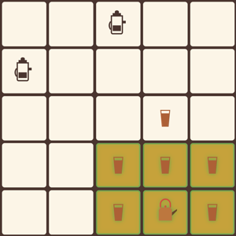
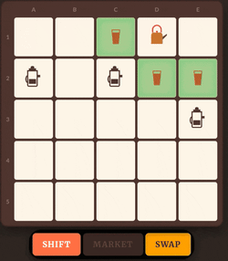
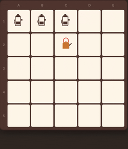
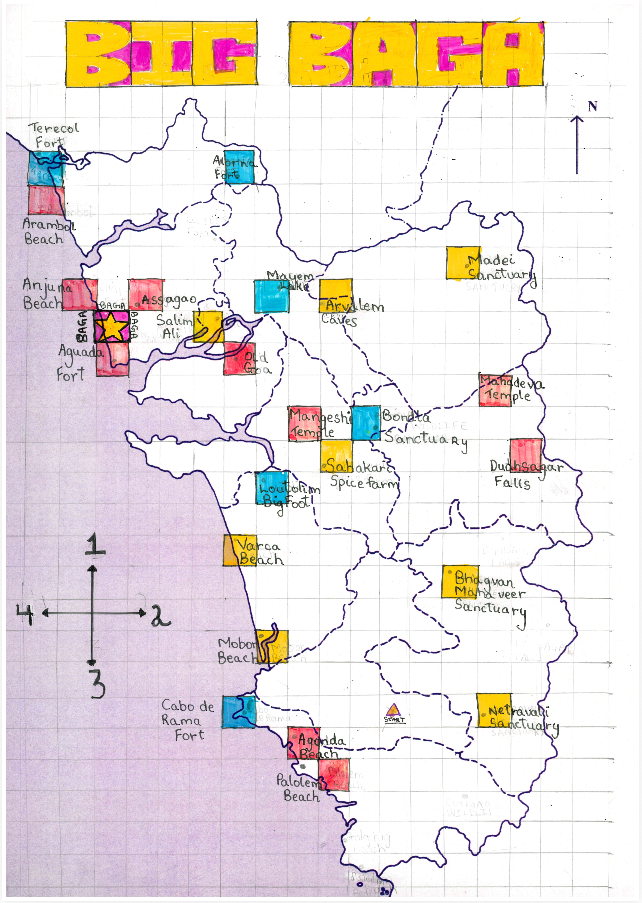

# Sagar Arlekar - Senior Software Engineer — Backend & Data
---
### 👋 About me
Senior Software Engineer based in **New York**.

Currently at **[VTS](https://www.vts.com)** building Data Pipelines and AI products on top of 13 billion sq ft of commercial real estate data. Previously engineered bookings and search services at **WeWork**, led teams at **Trantor** in Fintech and Government Projects, built spatial infrastructure, transportation simulations at **CSTEP**, and co-founded **Foodlets**.

---

### 🛠️ What I work with now

### 🗄️ What I worked with before

### 💻 My local setup

---

### 🫖 Barista vs Chaiwala — an original board game

You're the Chaiwala vs three Baristas — capture customers and open a chai stall before you're boxed in and eliminated! A tactical duel of wits — more intricate than tic-tac-toe, far simpler than chess — inspired by **cellular automata** and **asymmetric games**.

  
  
  

Online edition in **private preview** — [**reach out**](https://www.linkedin.com/in/sagararlekar/) to play.

---

### 🏖️ Big Baga — a map-based board game

Race across Goa to Baga Beach! Roll two dice, then choose one for **direction** and one for **distance** — so every roll is a gamble *and* a decision. Grab landmarks for points, bump rivals back to Start, and don't fall into the sea. A 2–4 player game of luck and nerve.

  

Want a printable board? [**reach out**](https://www.linkedin.com/in/sagararlekar/) for a copy!

---

### 📊 Highlights

| 🗓️ **15+ years** shipping production software | 📐 **13B sq ft** of real estate data at VTS |
|:---|:---|
| 🤖 **Conversational AI** with AWS AgentCore + RAG | 🚀 **1 startup co-founded** (Foodlets) |
| 📦 **2 Ruby gems** | 🌍 **Published research** in GIS & simulations |
| 🏛️ Worked across **startups, government & research** | 🎲 **2 original board games** designed |

---

💬 [linkedin.com/in/sagararlekar](https://www.linkedin.com/in/sagararlekar/)

